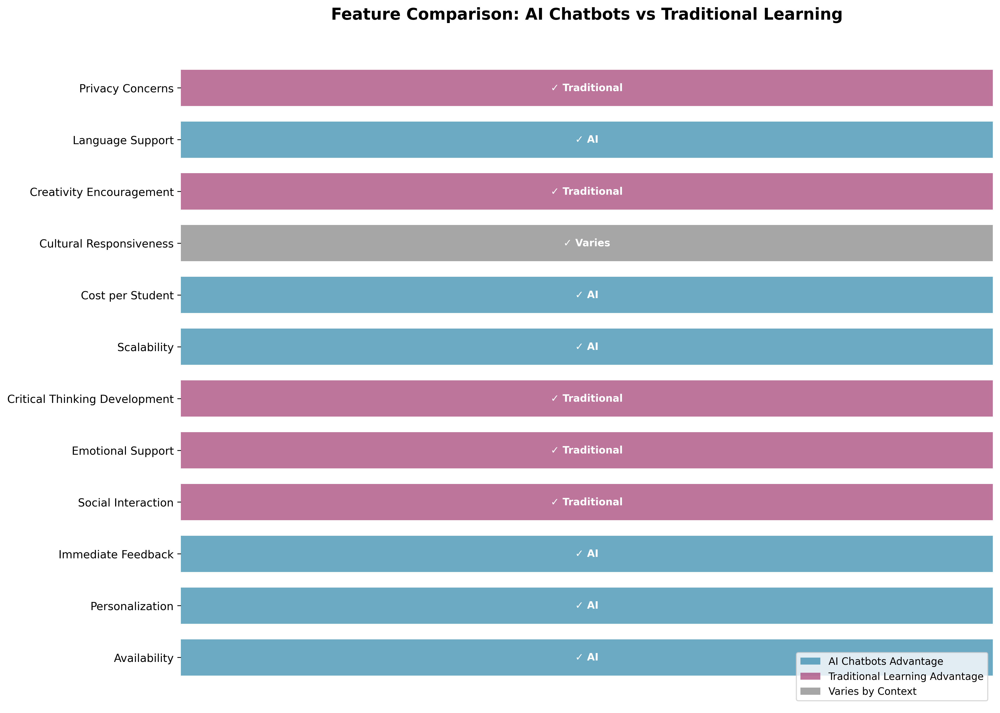
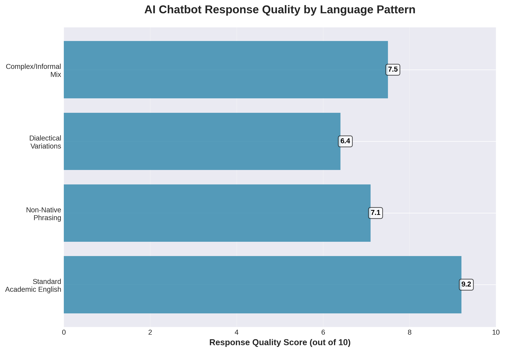

# Comparative-Study-AI-Chatbots-vs.-Traditional-Learning-in-Education
## 📖 Introduction

The integration of AI chatbots into educational environments represents a significant shift in how students access learning resources. This study critically examines both the promises and pitfalls of this technology, with particular attention to ethical considerations and equity in educational outcomes.

### Research Questions

1. How do learning outcomes differ between AI chatbot-based and traditional learning methods?
2. What accessibility benefits and barriers does each approach present?
3. How might AI chatbot systems perpetuate or mitigate educational biases?
4. Which student populations benefit most from each learning modality?

This comparative study synthesizes:
- Literature review of educational technology research (2020-2025)
- Analysis of SchoolAI.com platform features and data practices
- Examination of chatbot learning benefits documented in educational settings
- Critical evaluation through an equity and ethics lens informed by data science principles

## Comparative Analysis

### Feature Comparison Matrix

| Feature | AI Chatbots | Traditional Learning | Advantage |
|---------|-------------|---------------------|-----------|
| **Availability** | 24/7 access | Limited to class hours | ✅ AI Chatbots |
| **Personalization** | Adaptive to individual pace | Group-paced instruction | ✅ AI Chatbots |
| **Immediate Feedback** | Instant responses | Delayed (hours to days) | ✅ AI Chatbots |
| **Social Interaction** | Limited to AI | Rich peer collaboration | ✅ Traditional |
| **Emotional Support** | Algorithmic empathy | Human connection | ✅ Traditional |
| **Critical Thinking Development** | Template-based prompts | Socratic dialogue | ✅ Traditional |
| **Scalability** | Unlimited students | Limited by instructor capacity | ✅ AI Chatbots |
| **Cost per Student** | Low (after development) | High (instructor time) | ✅ AI Chatbots |
| **Cultural Responsiveness** | Depends on training data | Depends on instructor | ⚖️ Varies |
| **Creativity Encouragement** | Pattern-based suggestions | Open-ended exploration | ✅ Traditional |
| **Language Support** | Multi-lingual capability | Limited by instructor | ✅ AI Chatbots |
| **Privacy Concerns** | Data collection/tracking | Minimal data collection | ✅ Traditional |

### Visual Feature Comparison

### Effectiveness Comparison Chart

## Benefits and Limitations

### AI Chatbot-Based Learning

#### **Benefits**

**Personalized Learning Experience** - Adaptive interactions tailored to individual student needs, with self-paced progression and customized difficulty levels based on performance.

**Immediate Feedback and Guidance** - Real-time responses to student queries provide instant correction of misconceptions and on-demand clarification without wait times.

**Safe Learning Environment** - Freedom to make mistakes without judgment reduces social anxiety in asking questions and builds confidence through positive reinforcement.

**Accessibility and Convenience** - 24/7 availability across time zones with multi-lingual support provides consistent instruction regardless of location or schedule.

**Scalability** - Serves unlimited students simultaneously with consistent quality of instruction at a cost-effective rate for large populations.

#### **Limitations**

**Limited Emotional Intelligence** - Cannot fully understand complex emotional states, may miss nuanced signs of student struggle, and lacks genuine human empathy and intuition.

**Potential for Bias** - Training data may reflect societal biases, provide different quality responses based on phrasing, and could disadvantage non-native speakers or certain dialects.

**Reduced Social Interaction** - Minimizes peer-to-peer learning opportunities, limits development of collaboration skills, and may increase isolation for vulnerable students.

**Privacy and Surveillance Concerns** - Extensive tracking of student interactions raises privacy questions and creates potential for misuse of learning analytics.

**Dependency Risk** - May reduce critical thinking if over-relied upon, could diminish problem-solving resilience, and risks students expecting instant answers to all problems.

**Technology Barriers** - Requires reliable internet access and device availability, which may exclude students from low-resource backgrounds.

### Traditional Learning

#### **Benefits**

**Rich Social Interaction** - Peer collaboration and knowledge sharing develops communication skills while building learning communities.

**Human Connection** - Genuine empathy and emotional support through mentorship relationships provides role modeling and inspiration.

**Adaptability to Context** - Instructors can read room dynamics, pivot based on student needs, and provide cultural and contextual responsiveness.

**Deep Critical Thinking** - Socratic dialogue and debate encourages complex problem-solving discussions and independent thought.

**Minimal Privacy Concerns** - Limited data collection with transparent assessment methods where personal interactions aren't permanently recorded.

#### **Limitations**

**Limited Availability** - Constrained by class schedules and instructor office hours that may not fit all schedules, with geographic and time zone barriers.

**Scalability Challenges** - Instructor capacity limits class sizes at high cost per student, with quality varying based on instructor workload.

**Inconsistent Quality** - Depends heavily on individual instructor effectiveness and teaching style, remaining subject to instructor biases.

**Delayed Feedback** - Days or weeks for assignment feedback with limited real-time clarification means students may practice errors repeatedly during independent study.

**Social Anxiety Barriers** - Fear of judgment may prevent question-asking, public mistakes can be embarrassing, and the format may disadvantage introverted learners.

## ⚖️ Bias in AI Responses

### Types of Bias in Educational AI Chatbots

#### 1. **Training Data Bias**

**Description:** AI chatbots are trained on historical data that may reflect societal biases, inequalities, and underrepresentation of certain groups.

**Manifestations:**
- Answers may reflect cultural assumptions of dominant groups
- Examples and analogies may be culturally specific
- Historical data may underrepresent contributions from marginalized groups
- Language patterns may favor standard dialects over vernacular

**Example Scenario:**
> A student asks: "Give me an example of a successful entrepreneur."
> - Biased response might predominantly feature white male tech founders
> - Equitable response would include diverse entrepreneurs across industries, genders, and cultures

#### 2. **Language Processing Bias**

**Description:** Natural language processing models may perform better with standard grammar, syntax, and vocabulary, disadvantaging speakers of non-standard dialects or non-native speakers.

**Impact on Students:**
- Non-native English speakers may receive lower-quality responses
- Students using African American Vernacular English (AAVE) or other dialects may face misunderstanding
- Complex questions may be interpreted differently based on phrasing

**Data Evidence:**

#### 3. **Socioeconomic Context Bias**

**Description:** AI responses may assume access to resources, experiences, or cultural knowledge that varies by socioeconomic status.

**Examples:**
- Assuming students have traveled internationally
- References to activities requiring financial resources (sports, music lessons, tutoring)
- Examples using expensive technology or brand names
- Cultural references from affluent contexts

**Equity Impact:**
Students from lower-income backgrounds may:
- Feel excluded by examples they cannot relate to
- Perceive content as "not for them"
- Miss connections due to unfamiliar references
- Experience reduced engagement and motivation

#### 4. **Confirmation Bias in Feedback**

**Description:** AI may reinforce existing student beliefs without challenging assumptions, particularly if those beliefs align with patterns in training data.

**Risk:**
- May not push students to consider alternative perspectives
- Could reinforce stereotypes present in training data
- Might validate misconceptions if phrased confidently

#### 5. **Representation Bias**

**Description:** Content generated by AI may underrepresent certain groups in examples, case studies, and scenarios.

**Manifestation in Education:**

| Domain | Typical AI Representation | Equity Issue |
|--------|-------------------------|--------------|
| STEM Examples | Male scientists/engineers | Gender bias, discourages women |
| Leadership Scenarios | Western, corporate contexts | Cultural bias, limits perspective |
| Historical Examples | Eurocentric focus | Racial/ethnic bias, incomplete history |
| Family Structures | Nuclear families | Bias against diverse family types |
| Economic Examples | Middle-class assumptions | Socioeconomic bias |

## Recommendations

### For Educational Institutions

**Adopt Hybrid Approaches** - Combine AI chatbots for scalable, personalized support with traditional instruction for deep learning. Use AI for foundational knowledge while reserving human interaction for complex, nuanced topics.

**Ensure Equitable Access** - Provide devices and internet access to students who need them, create on-campus AI chatbot access points, and never make AI the sole path to course content. Monitor participation data for equity gaps.

**Implement Bias Audits** - Regularly test AI systems for bias across demographic groups, diversify training data and examples, create feedback mechanisms for students to report problematic responses, and publish transparency reports on AI system limitations.

**Protect Student Privacy** - Minimize data collection to essential educational purposes, provide clear opt-out options for non-essential tracking, ensure FERPA compliance, and give students control over their learning data.

**Train Faculty on AI Integration** - Educate instructors on AI capabilities and limitations, provide guidance on when to use AI versus human instruction, and develop protocols for reviewing AI-generated content.

### For AI Platform Developers

**Prioritize Fairness in Design** - Include diverse perspectives in development teams, test systems with representative user groups, build in fairness metrics from the start, and create accessible feedback mechanisms.

**Transparency in Limitations** - Clearly communicate what AI can and cannot do, acknowledge bias risks openly, provide guidance on appropriate use cases, and document training data sources and limitations.

**Multi-Modal Learning Support** - Integrate visual, auditory, and text-based learning while supporting various learning styles and accommodating assistive technologies.

**Privacy by Design** - Minimize data collection, provide granular privacy controls, encrypt all student data, and allow data deletion and portability.

### For Students

**Engage Critically with AI** - Question AI responses and seek verification from multiple sources. Report bias or problematic content and understand AI limitations.

**Balance AI and Human Interaction** - Use AI for practice and quick clarification but seek human instructors for complex topics. Participate in peer learning communities and don't isolate yourself with only AI support.

**Advocate for Equity** - Report access barriers to administrators, share feedback on AI tool effectiveness, support peers who face technology barriers, and demand transparency in AI systems.

---

## Conclusion

The integration of AI chatbots into education presents both tremendous opportunities and significant risks. This comparative study reveals that neither AI chatbot-based learning nor traditional instruction is uniformly superior across all dimensions. Instead, each approach offers distinct advantages that benefit different aspects of learning and serve different student populations in varying ways.
